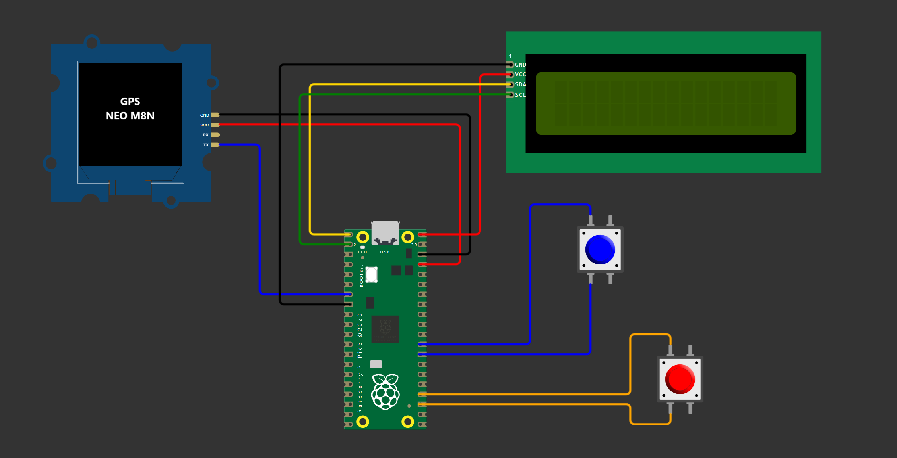

# Rally ICO / Tripmaster GPS with a Raspberry Pico

This project contain the instructions and source code on how to build an *adventure-ready* ICO / Tripmaster to assist a Roadbook using GPS signal. Using the a low-cost Raspberry Pico with a GPS module.

## 🎯Objective  
Create a budget friendly navigation solution to enable the participation in motorbike offroad rallies.

## 🧭What are we building?
In short: a GPS-based **compass** and **odometer**.

In long: We'll use the precision of GPS satellites to provide real-time odometry data (so you know how far you've gone) and directional information (so you know you are in the right course) to guide you like a digital roadbook whisperer keeping you on track during a rally event.

#### How it should look like

#### How it actually looks (after field testing it in a 389km rally event)

### The Roadbook
In a rally, you know where you’re starting, you know where you’re finishing, but the path in between? That’s a mystery only the **roadbook** can reveal. This trusty guide holds the instructions for your route —because just winging it won’t cut it here. As you tear through the course, you’ll pass through certain key checkpoints to prove you didn’t accidentally skip a part (the rally organizers are on to you!).

The roadbook itself is a collection of essential instructions: distances, directions (yep, precise degrees), and notes like "don't crash here" (okay, maybe not that specific). All you have to do is follow them, one by one, until you cross that finish line. Simple, right? Well... not really. Getting lost, taking a few *scenic* detours, and doing some U-turns are just part of the fun in these events. But hey, that's what makes it an adventure!

### The ICO / Tripmaster
To master the art of following the roadbook, you’ll need more than just a gut feeling and good luck—you need an ICO/Tripmaster. This handy device tells you two critical things: which direction you’re heading and how far you've gone, so you know exactly when that next instruction is coming (before you drive into oblivion).

And since getting lost is basically a rally rite of passage, the Tripmaster should come with a quick and easy way to reset or adjust your distance. Because, let’s face it, you’ll probably have to recalibrate after realizing that "this way" was, in fact, the wrong way. But no worries, it’s all part of the rally charm!

## 🛠️Let's build the thing!

#### Components required:
 - Raspberry Pico           
 - LCD Screen 16x2          
 - GPS NEO M8N              
 - GPS Antenna        
 - [Motorcycle Switch](img/switch.png)
 - Some cables

#### Connection diagram:

These are the pins I decided to use, because potato, if you use different ones, remember to ajdust the code.

#### Code

The source code can be found in the `src` folder. It has some dependencies, they need to live together with the code:
 - [lcd_api.py](https://github.com/oguzhanbaser/picoWorkspace/blob/master/pico-w-telegram/lcd_api.py)
 - [pico_i2c_lcd.py](https://github.com/oguzhanbaser/picoWorkspace/blob/master/pico-w-telegram/i2c_lcd.py)
 - [micropyGPS.py](https://github.com/inmcm/micropyGPS/blob/master/micropyGPS.py)

The code also requires to have installed the `picozero` package into the raspi in order to make use of the buttons.

**VERY IMPORTANT:** Comment out all `gc.collect()` from `i2c_lcd.py` file to make the system usable, otherwise it is way too slow.

#### Run in device
After setting up everything required, when plugged in, you will just need to wait to get GPS signal. Once the GPS signal locks in, the display will show up all the vital info distributed like this:

THE EASIEST MANUAL EVER:
- **Button up**: Will increase the distance by 0.01. If hold, it will keep increasing, faster and faster after some seconds. 
- **Button down**: Will decrease the distance by 0.01. If hold, it will keep decreasing, faster after some seconds, but not as fast as increasing. This is by desig.
- **Both bottons**: A reset message with a countdown will appear, hold on both for 10 seconds, and the distance will be set to 0.00 

*NOTE: Course degrees, like speed, are only displayed when moving.*
 
 

## 💸Cost analysis
In our quest to keep costs as low as possible (because who doesn’t love a good deal?), here’s a breakdown of the expenses. We opted for a 3D-printed roadbook box that some guy was selling on internet—not exactly the pinnacle of craftsmanship, but hey, it gets the job done and keeps the wallet happy!

| Item | Price |
|---|---:|
| Roadbook box | 40€ |
| Raspberry Pico | 2.43€ |
| LCD Screen 16x2 | 3.49€ |
| GPS NEO M8N + Antenna | 9.73€ |
| Motorcycle Switch | 3.20€ |
| Cables | 1.99€ |
--- Others ---
| Connectors cable | 1.99€ |
| Battery Switch | 7.99€ |
| Ram support base | 5.93€ |
| Small Tupper | 2.49€ |
| Converter 12v to 5v | 2.08€ |
| **TOTAL** | **81.32€** |

Considering a high-end setup can easily run you easily upwards of 1000€, this budget-friendly build is a serious win. Sure, it might not have all the bells and whistles of those premium systems, it may break down easily, it may not last much, but for just 80€, you’re ready to rally without breaking the bank. At the end of the day, we are just enthusiasts that only assist to non competitive events to have fun, we don't need the perfect machinery.

## 🙏Comments, Feedback and improvements
Got ideas, suggestions, or spotted something that could be done better? We’d love to hear from you! Whether you want to drop some feedback, suggest improvements, or even contribute directly by opening an issue or submitting a merge request (MR), we’re all for it. Don’t be shy, reach out, and I’ll gladly get back to you.
 
 
 

👨‍💻Happy codning, 
🛵happy riding.